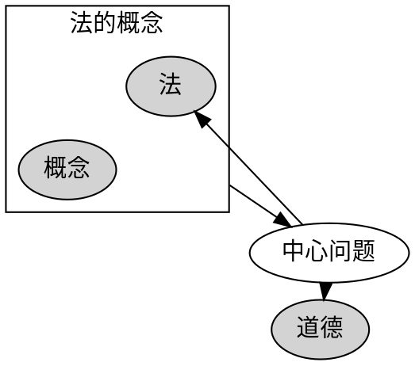
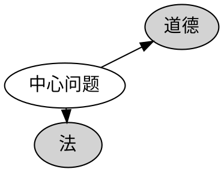
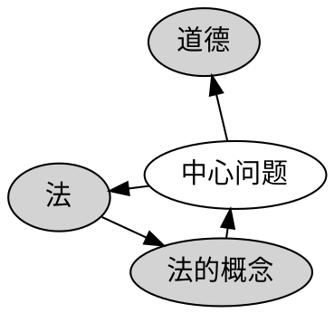
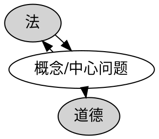
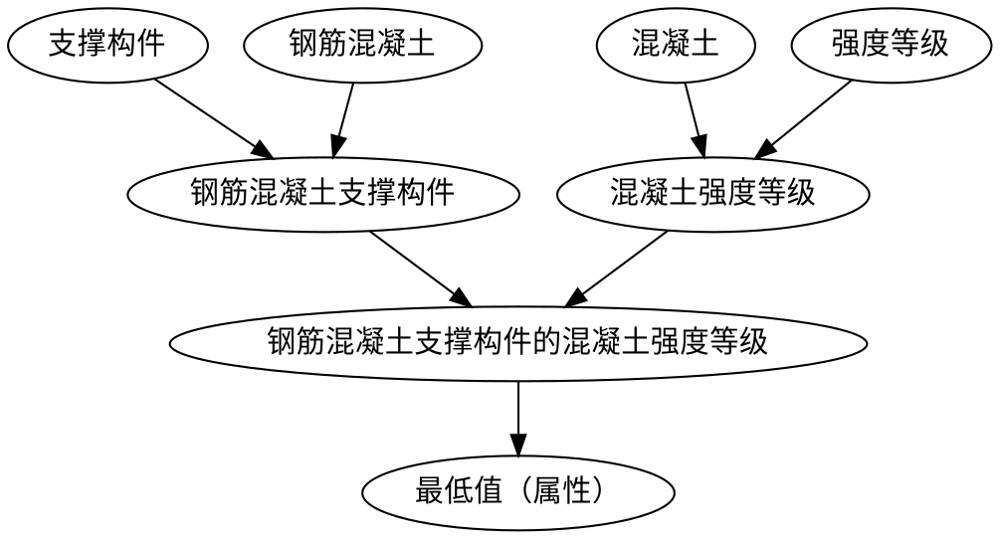
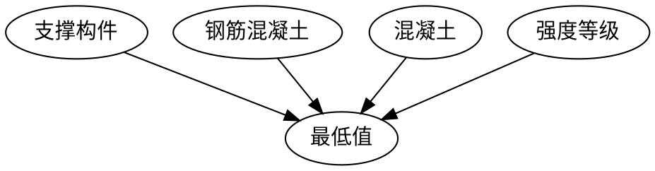

# 引用增强模式的主要思想

## 应用知识图谱的三元组的失败

知识图谱将信息归为实体、关系和属性，起初，我在记笔记的时候，试图将笔记按照三元组的形式进行链接，从而绘制出清晰的关系图，但是很快我就失败了。原因在于，对于以块为原子的双链笔记，其实体、关系和属性非常复杂，往往并不像人物关系图一样简单明了。下面举两个例子：

### 实体的属性又与其他实体相关

> 围绕着法的概念的争论的中心问题是关于法与道德之间的关系。 
>

这句话描述的是`法的概念`与`法`、`道德`之间的关系，其关系是`中心问题`。`法的概念`是法的属性，同时其又与两个实体有关系。

如果可能的话，理想的关系图应如下所示：

但是实际上很难将`法`和`概念`“捆绑”到一起，只能采取其他方法。现在有三种方案，一是仅将`法`作为一个实体（即简化实体方案）,二是新增加实体`法的概念`（即增加实体方案），三是将关系变为`概念的中心问题`（即增加关系方案）.

第一种方案直接把这句话描述的关系改变了，简化为了`法`与`道德`之间的关系，但这两者之间的关系显然不是仅限于这句话所描述，其关系图为：

第二种方案增加了一个实体`法的概念`，描述的关系是完整的，但是这样新增加了一个不常用的实体，也不符合通常的实体定义。其关系图为：

第三种方案产生了一个不常用的关系,其关系图为:

### 实体与实体组合又产生新的实体

> 1)钢筋混凝土支撑构件的混凝土强度等级不应低于C25；
>

这句话描述的是`钢筋混凝土`材质的`支撑构件`使用的`混凝土`对`强度等级`属性的`最低值`要求。`钢筋混凝土`与`支撑构件`组合成新实体`钢筋混凝土支撑构件`,`混凝土`与`强度等级`组合成新实体`混凝土强度等级`，之后，它们又组合成`钢筋混凝土支撑构件的混凝土强度等级`新实体。

理想的关系图应为：

为一个块添加如此多的节点和关系，显然是不合适的，这会大大增加笔记的维护难度。

但是仅仅是单纯的链接，又很难表达清楚语义：

而且这种含糊的关系会随着笔记的增加变得越来越难以辨认，因为需要逐个寻找这个块连接的所有实体，而理想情况下块只与一个实体相连，其他实体之间的关系均为部分与整体或者一般与特殊关系，很容易辨认。

## 叙词法的引入

为了应对上述复杂情况，引入了叙词法的思想。

> 所谓叙词法，是以从自然语言中精逃出来的、经过严格处理的语词作为文献主题标识，通过概念组配方式表达文献主题的主题法类型。叙词，国内亦称主题词，是经过规范化处理的，以基本概念为基础的表达文献主题的词和词组。
>

简单来说，上述例子中`支撑构件`、`钢筋混凝土`、`法`等都可以均为叙词，叙词法的主要思想就是概念组配，即通过实体合成实体，只要把部分属性也作为实体，如`概念`，那么就能解决关系图的难题。但是，这需要程序自动实现实体的合成，识别哪些是关系不参与组配，哪些是并列的词语不需要组配，组配到哪里结束等，于是我设置了一些方法来进行识别。

叙词法在笔记关系图中的作用主要是：  
1.是比较成熟的方法，有一整套词汇控制方法来规定哪些词应该用组配（后组词），哪些词应该直接作为实体选用（先组词），为笔记中信息的抽取提供指导（当然不必完全符合这些原则）。  
2.规定了三类关系，而且均可以通过双链笔记特性解决，等同关系对应于别名、命名，等级关系对应笔记层级，相关关系对应引用和反向引用

词汇控制方法，可以参见[叙词语言的词汇控制](https://github.com/etchnight/Siyuan_Network2/blob/master/doc/叙词语言的词汇控制.md)
